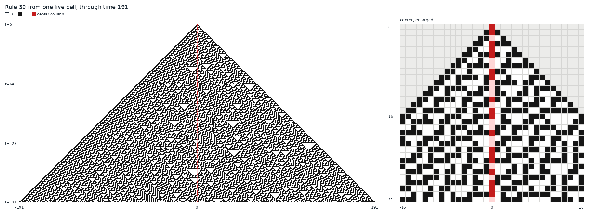
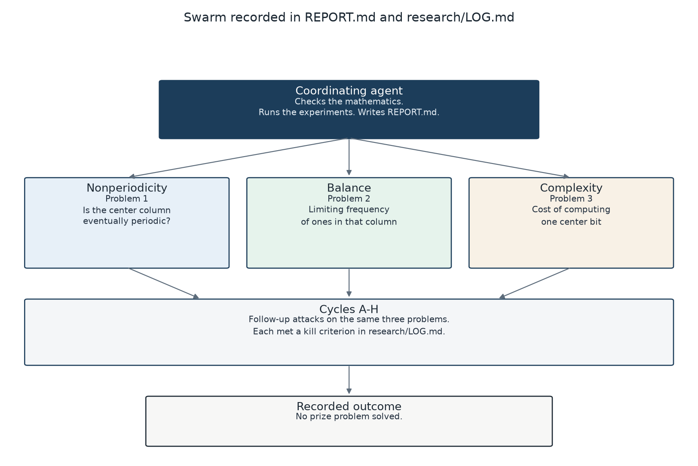
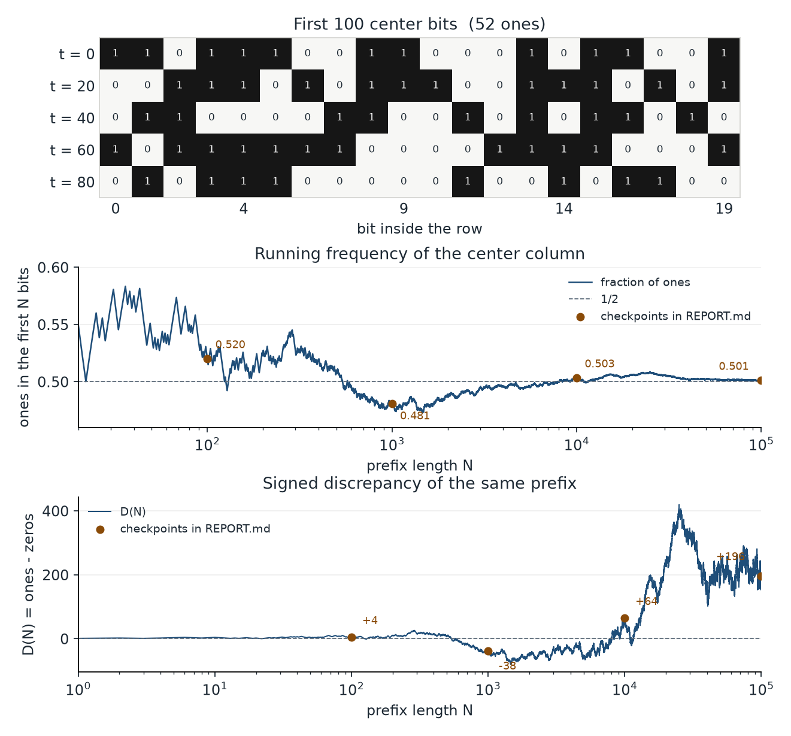
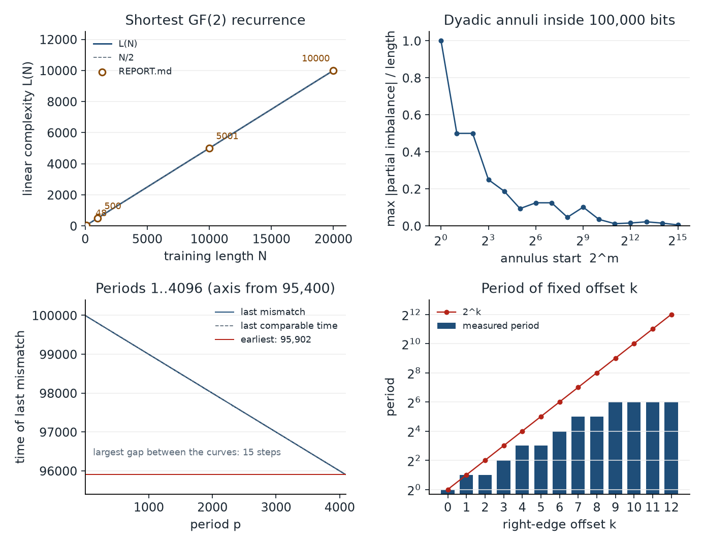

# Rule 30 prize research

Sustained attempt at the [Rule 30 prizes](https://rule30prize.org/).
**No prize problem is solved.** Do not submit or contact the committee
from this repo.



*Rule 30 from the single-cell seed, times 0 through 191. White is 0,
black is 1, and red is the center column `c_t = x(t, 0)`. The right
panel enlarges columns `j = -16` through `16` for the first 32 steps.
Same local rule as `experiment.py`.*



*How this repository was produced. Three agents took the three prize
problems; the coordinating agent checked the arguments and ran the
experiments. Cycles A-H are the follow-ups in
[research/LOG.md](research/LOG.md). The outcome is the one recorded in
[REPORT.md](REPORT.md): no prize problem solved.*

## Continue on another machine

```sh
git clone git@github.com:cochon123/rule30-prize.git
cd rule30-prize
python3 experiment.py --bits 1000
```

Read in this order:

1. [REPORT.md](REPORT.md) — checked conclusions and cycle summaries
2. [research/LOG.md](research/LOG.md) — what was tried and what died
3. The notes those files cite under `research/`

Last completed cycle is **U**. Every binary word of length \(\le 14\)
occurs in the centre (period/preperiod \(\ge 16384\) if eventually
periodic). That is not disjunctivity. The prize is still open.

Do not overwrite `experiment.py`, `research/strip_graph.py`, or
`research/strip_extend.py`.

## Constraints that still hold

- Official site still open; width-1 center periodicity is the gap after
  Jen/Kopra (width-2 aperiodicity).
- Infinitely many 0s and 1s in the center are proved.
- Isolated-zero periods `01^q` are excluded except `q ∈ {1,2,3,4,5,6,8}`.
- Period 2 has no uniform-in-onset bound (`maxR=16` at `T=20` is still
  the worst through `T=34`). The even right neighbor of a period-2
  centre has no five consecutive zeros, in addition to no consecutive
  1s. Origin-in-hull rows of weight `≤10` and span `≤20` (weight `≤8`
  through span 24) have `L_run≤31`. Off-hull weight-8 reaches 35.
  Periods 3–7 and `q=8` remain.
- Density and linear-time computation are untouched by a proof.
  Problem 2 is exactly \(N_{11}-N_{00}=o(N)\) via
  \(D(N)=N_{11}-N_{00}+c_{N-1}\).



*Center column of the 100,000-bit run reported in [REPORT.md](REPORT.md).
The grid is `c_0` through `c_99`. Its first row is the 20-bit self-check
in `experiment.py`, and 52 of the 100 bits are 1. The curves are the
running frequency of ones and `D(N)`, ones minus zeros. Marked points are
the published checkpoints. The frequency axis runs from 0.46 to 0.60.
These prefixes are not a proof that the density is 1/2.*



*Finite checks from `experiment.py` on that same prefix. `L(N)` is the
shortest binary recurrence fitted to the first N bits. Circled points are
the four training lengths in REPORT.md. The dashed line is `N/2`, drawn
only as a scale. Each dyadic annulus is `[2^m, 2^(m+1))`; the panel shows
the maximum absolute partial imbalance divided by the annulus length.
Every period `p = 1` through `4096` still has a mismatch at or after time
95,902. The vertical axis starts at 95,400, and the measured mismatch
stays within 15 steps of the last time a mismatch can occur. The last
panel is the measured period of each fixed right-edge offset `k = 0`
through `12`; each period divides `2^k`. None of this proves
aperiodicity, `D(N) = o(N)`, or a superlinear cost.*

Helper scripts live in `research/`. Dumps are the matching `.json` files.
Astra briefs and idea lists are `research/_astra_brief*.md` and
`research/_astra_ideas*.md`.
The figures above are written by
[scripts/make_figures.py](scripts/make_figures.py).
